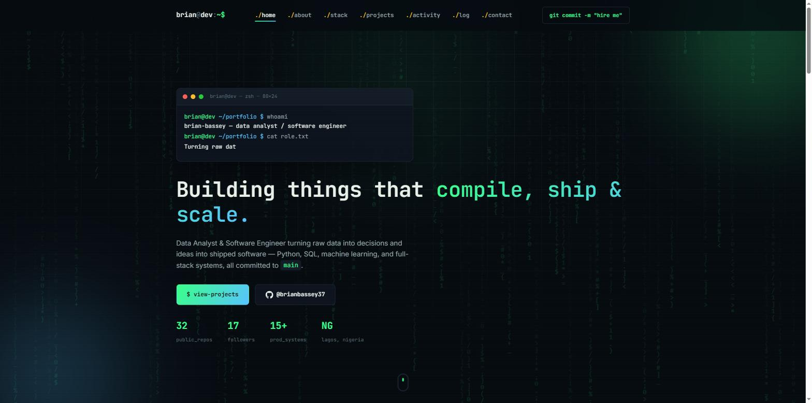
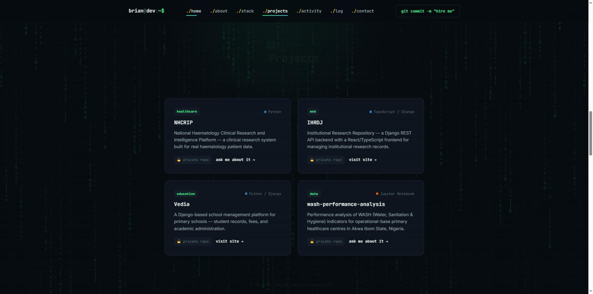

<div align="center">

# `brian@dev:~$` portfolio

### Personal site for **Brian Bassey** — Data Analyst & Software Engineer, Lagos 🇳🇬

[](https://brianbassey37.github.io/)
[](https://github.com/brianbassey37/brianbassey37.github.io/commits/main)
[](https://github.com/brianbassey37/brianbassey37.github.io)
[](#tech-stack)
[](#tech-stack)
[](LICENSE)

**[brianbassey37.github.io →](https://brianbassey37.github.io/)**

<br>



</div>

<br>

A terminal/hacker-styled single-page portfolio — dark theme, monospace type, a
live-typed terminal boot sequence, a matrix-rain canvas background, real-time
GitHub stats pulled from the GitHub API, and a career timeline rendered as
git commit history. No framework, no build step, no dependencies.

## Contents

- [Features](#features)
- [Screenshots](#screenshots)
- [Tech stack](#tech-stack)
- [Project structure](#project-structure)
- [Running locally](#running-locally)
- [Deployment](#deployment)
- [License](#license)
- [Contact](#contact)

## Features

- 🖥️ **Live terminal boot sequence** — the hero types out `whoami` / `cat role.txt` / `git log` on load, character by character
- 🌧️ **Matrix rain + scanline background** — canvas-rendered, low-opacity, theme-consistent, resize-aware
- 📊 **Live GitHub Activity** — real contribution count, streak, and contribution graph pulled straight from the GitHub stats APIs (not screenshots), with graceful fallback if a stat provider is briefly unavailable
- 🗂️ **Featured projects** — recent production work across healthcare, education, and public-health data, each tagged by domain with GitHub's actual language colors; private repos are marked `🔒 private repo` with either a live site link or a pre-filled "ask me about it" email link
- 📜 **Git-log-styled journey section** — career history rendered as commit history, complete with hashes and branch refs
- 🐚 **Console easter egg** — open devtools for a styled `console.log` greeting
- 📱 **Fully responsive** — mobile nav, fluid type, single-column fallback layouts
- ⚡ **Zero dependencies** — plain HTML/CSS/JS, deployable as static files, no build step

## Screenshots

<div align="center">


</div>

## Tech stack

| Layer     | Tech                                                        |
|-----------|--------------------------------------------------------------|
| Markup    | Semantic HTML5                                                |
| Styling   | Plain CSS — custom properties, grid/flexbox, no framework     |
| Behavior  | Vanilla JavaScript — no build tools, no dependencies           |
| Fonts     | [JetBrains Mono](https://www.jetbrains.com/lp/mono/), [Inter](https://rsms.me/inter/) via Google Fonts |
| Hosting   | [GitHub Pages](https://pages.github.com/)                     |
| Live data | [github-readme-stats](https://github.com/anuraghazra/github-readme-stats), [github-readme-streak-stats](https://github.com/DenverCoder1/github-readme-streak-stats), [ghchart](https://github.com/2016rshah/githubchart-api) |

## Project structure

```
.
├── index.html                 # All page markup/sections
├── assets/
│   ├── style.css               # Design tokens, layout, components, animations
│   └── script.js                # Project/skill data, rendering, terminal + matrix-rain effects
├── docs/
│   └── screenshots/             # README preview images
└── README.md
```

## Running locally

No build step — just serve the directory:

```bash
git clone https://github.com/brianbassey37/brianbassey37.github.io.git
cd brianbassey37.github.io
python -m http.server 8000
# open http://localhost:8000
```

## Deployment

Pushes to `main` deploy automatically via GitHub Pages (source: `main` / root) —
live at [brianbassey37.github.io](https://brianbassey37.github.io/) within a
minute or two of every push.

## License

All rights reserved — see [LICENSE](LICENSE). This code is public for
reference only; it may not be copied, reused, or redistributed without
permission.

## Contact

<div align="center">

[](https://github.com/brianbassey37)
[](mailto:brianbassey37@gmail.com)
[](https://github.com/brianbassey37)

</div>

